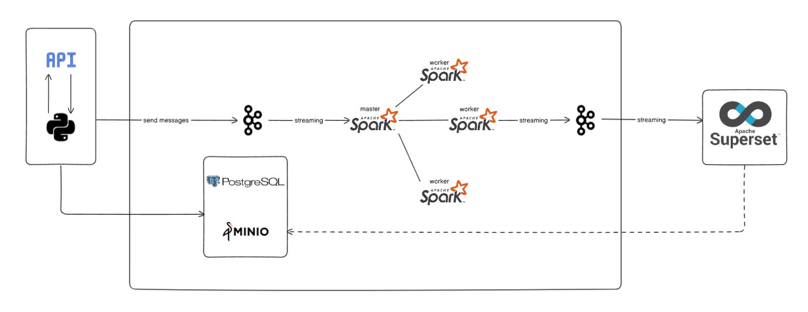

# Voting Simulation



## Introduction

This project is a voting simulation system designed to demonstrate a modern data pipeline and analytics stack. It leverages Apache Kafka for streaming, Apache Spark for processing, PostgreSQL for storage, and Apache Superset for dashboarding and analytics. The system is orchestrated using Docker Compose for easy setup and reproducibility.

## Architecture

The system consists of the following main components:
- **Zookeeper & Kafka**: For event streaming and message brokering.
- **PostgreSQL**: For persistent storage of voting data.
- **Apache Spark**: For distributed data processing.
- **Apache Superset**: For data visualization and dashboarding.

## Prerequisites

- [Docker](https://www.docker.com/products/docker-desktop) and [Docker Compose](https://docs.docker.com/compose/) installed on your machine.

## Getting Started

1. **Clone the repository**
    ```sh
    git clone <your-repo-url>
    cd voting-system
    ```

2. **Build and start the system**
    ```sh
    docker-compose up -d
    ```

3. **Access the services**
    - **Superset Dashboard**: [http://localhost:8088](http://localhost:8088)
      - Login with username: `admin`, password: `admin`
    - **PostgreSQL**: Accessible at `localhost:5432` (user: `postgres`, password: `postgres`, db: `voting`)
    - **Kafka Broker**: Accessible at `localhost:9092`
    - **Spark Master UI**: [http://localhost:9090](http://localhost:9090)

4. **Stop the system**
    ```sh
    docker-compose down
    ```

## Customization

- You can modify the services and environment variables in `docker-compose.yaml` to fit your requirements.
- Place your own data pipeline, Spark jobs, or Superset dashboards as needed.

## Notes

- The first time you run Superset, it may take a few minutes to initialize.
- Make sure ports `8088`, `5432`, `9092`, and `9090` are available on your machine.

## License

This project is for educational and demonstration purposes.